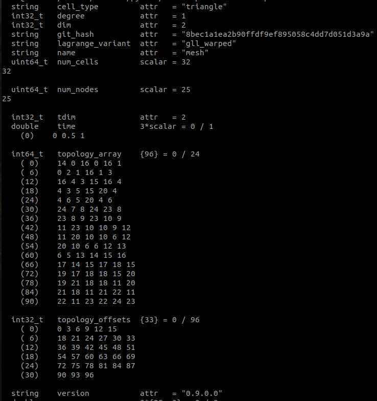
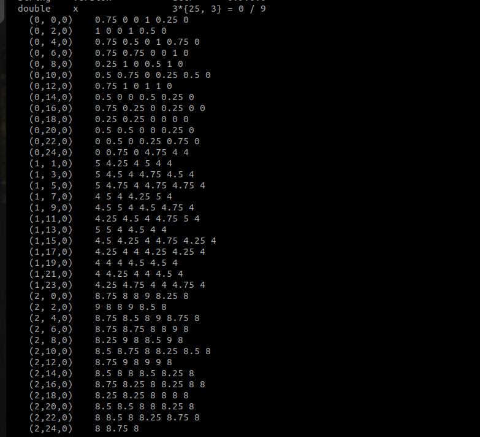
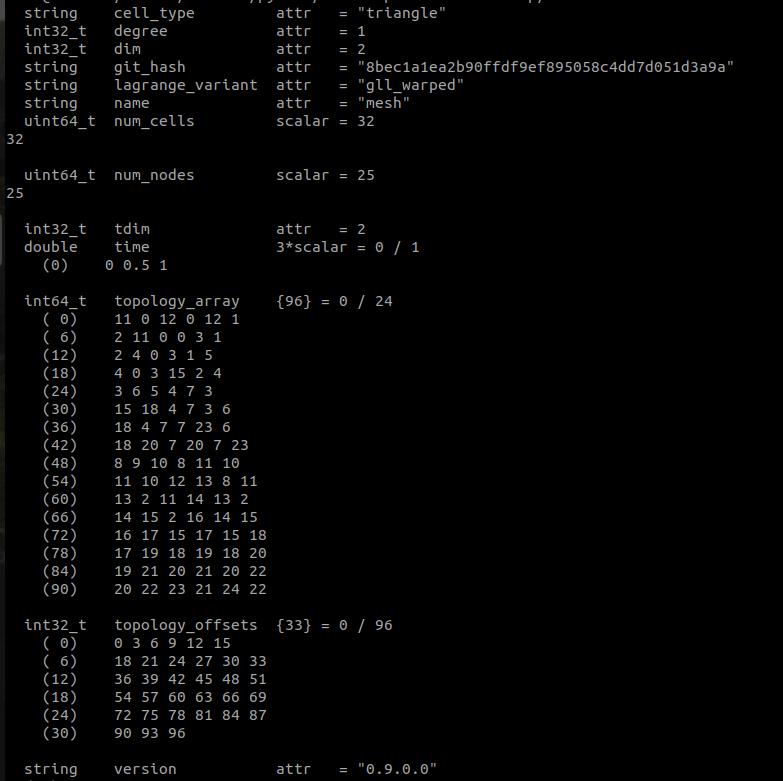
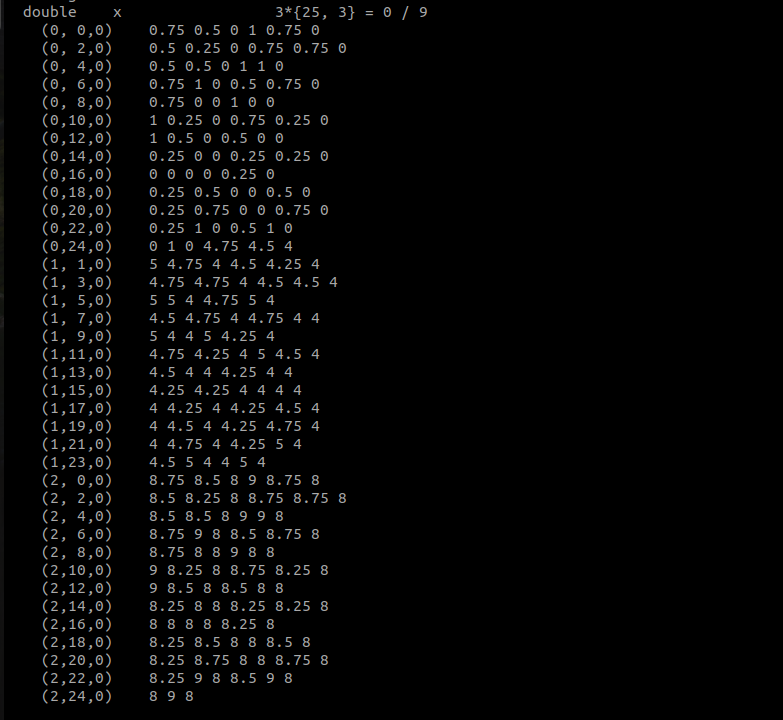

# Checkpointing in DOLFINx using ADIOS2

This project is dedicated to the implementation of native checkpointing in
the FEniCS project which is a popular open-source computing platform
for solving partial differential equations (PDEs) with
the finite element method (FEM).
Large scale simulation of scientific and engineering problems requires
high performance and distributed memory systems.
Computing resources and time are not unlimited and efficient usage of the
computing resources calls for scalable and flexible checkpointing which
is the ability to start, pause and resume simulations, thus saving energy
consumption and money.

The common use case of checkpointing is for visualization, which calls for
mapping the data structures of the scientific simulation softwares to the
dedicated file formats, for example VTX and VTKHDF etc, which can then be
recognized by the visualization tools like Paraview and ViSit.
Other use cases of checkpointing include:
(i) flexible start and stop of the simulation,
(ii) control over simulation in case of diverging iterative solvers,
(iii) for aggregated post processing and
(iv) in adjoint computations.

The goals of this GSoC project and its extended future work is based on the
inclusion of the prototype checkpointing framework
[ADIOS4DOLFINx](https://jsdokken.com/adios4dolfinx/README.html,)
into DOLFINx the main component of the FEniCS project.
ADIOS4DOLFINx ([Dokken, 2024](https://github.com/openjournals/joss-papers/blob/joss.06451/joss.06451/10.21105.joss.06451.pdf))
implements several variations of checkpointing using the state of
the art *The Adaptable Input Output (I/O) System* called
[ADIOS2](https://csmd.ornl.gov/software/adios2).

In the current state of the project, we have only focussed on the N-to-M checkpointing,
i.e., writing (saving) on N processors and reading (loading) on M processors.
This is useful since, postprocessing and visualization of the simulation is generally a
distinct part of the workflow with dedicated softwares which need to consume the data of
the simulation from a compute cluster and may usually be performed locally with different
number of processors.

This checkpointing functionality is developed as a core feature of the DOLFINx.
Since DOLFINx is a C++ library with a Python wrapper,
this feature is implemented in C++ with appropriate APIs
exposed to the python user using nanobind.

N-to-N optimized version of checkpointing with the partition information stored and
snapshot checkpointing are deferred for future.

The current state of the work of this GSoC project consists of the following *pull requests* (PRs):

1. Write and read mesh using ADIOS2 [(open)](https://github.com/FEniCS/dolfinx/pull/3291)
2. Write and read meshtags using ADIOS2 [(open)](https://github.com/FEniCS/dolfinx/pull/3324)
3. Write functions using ADIOS2 [(open)](https://github.com/FEniCS/dolfinx/pull/3368)

The mentors for this GSoC project were Jørgen S. Dokken and Jack S. Hale.

## Preparation: tinkering with DOLFINx and experimenting with VTKHDF

 1. To understand the data structures of DOLFINx, parallel debug of demos was helpful
 2. networkx python graph library was used to understand geometry and topology dof local and global enumeration and visualize the partitions.
    NOTE: There already exists a more mature tool [febug](https://github.com/nate-sime/febug) to do the same and much more.
 3. Tangential to the goals of the project, we first tried checkpointing using the
    [VTKHDF](https://docs.vtk.org/en/latest/design_documents/VTKFileFormats.html#vtkhdf-file-format) file format,
    since it can also be used for visualization in Paraview.

## ADIOS2
Coming back to the main goal of this GSoC project which was to use ADIOS2 library to
create native checkpointing for DOLFINx, we give a brief introduction of ADIOS2.
ADIOS2 is an open-source framework that provides solutions for scalable
parallel I/O for scientific data management, with a unified application
programming interface (API) for various backends.
The ADIOS2 concepts of typical scientific data handling is done via

 - Variable: which are n-dimensional data objects with premitive data types
 - Attribute: defines the associated meta-data
 - Step: an abstraction for sequence of quantities, eg., time-step, iteration-step, etc
 - Engine: the unified interface to different backends handling different file types, data transfer over networks, etc
 - Operator: data compression task via third party libraries.

Moreover, it is possible to have an hardware aware fine tuning of
parameters of ADIOS2 though run time configuration files.
We use only a tiny subset of the features of the ADIOS2 library.
Our target engine types are BP4, BP5 and HDF5, and our unit tests have successfully passed for BP4 and BP5.
We write data from (multiple) processes to global arrays and read back chunks to reconstruct the DOLFINx objects: Mesh, Meshtags and Functions.

NOTE: An idea for a future feature enhancement is that we could use data compression operators for arrays which store topology offsets
and cell types which have a great potential for compression.

### Typical write

A typical task in writing the data consists of determining (fetching/computing)
the global sizes of the arrays, finding the local section identified via offset
and count in the global arrays.
And preparation of the array and calling `engine.Put(...)` which will then either
immediately write, or put to ADIOS2 internal buffer or defer the write until the
EndStep collective.
This behaviour is either enforced (hardcoded) in the implementation based on a
necessity for a specific variable or controlled at runtime via config files.
The functionality of control via config files needs to be thoroughly tested yet.

Example:
```
   adios2::Variable<T> var_x = io.DefineVariable<T>("x",
                                                {num_dofs_global, 3},
                                                {offset, 0},
                                                {num_dofs_local, 3},
                                                adios2::ConstantDims);

   engine.Put(var_x, x.data());
```

### Typical read
We first check if specific arrays exist in the checkpointed data and fetch a selection
from the global arrays to each process reading the data.
Then with all the necessary tools that already exist in DOLFINx and its mesh partitioning dependencies,
MPI neighbourhood communications are performed and the DOLFINx objects:
Mesh, MeshTags, and Functions are reconstructed.

### Wrapper to ADIOS2 for creating DOLFINx python APIs

ADIOS2 is written in C++ and has many language bindings including one for Python.
However the Python bindings are created using pybind, whereas the Python bindings
in DOLFINx are created using nanobind, therefore we created a basic wrapper to
ADIOS2.

The below snippet shows the creation of ADIOS2 instance and adding
an IO with tag `mesh-write` and opening `mesh.bp` file with a corresponding
Engine in the `write` mode.
The file `checkpointing.yml` contains the ADIOS2 configurations.

```python
import os
from dolfinx import io

config_path = os.getcwd() + "/checkpointing.yml"
adios2 = io.ADIOS2(config_path, MPI.COMM_WORLD)

tag = "mesh-write"
adios2.add_io(filename="mesh.bp", tag=tag, mode="write")

```

## Checkpointing module (part 1): Mesh

For the checkpointing of Mesh, we need to store
    1. versioning for backward compatibity checks
    2. geometry: nodes defined with their coordinates, and a finite element that will create the triangulation
    3. topology: cell to node connectivity

Note that node coordinates can be time dependent, hence, geometry can be time dependent, whereas topology is constant over time.

The metadata for checkpointing of Mesh is:

1. Attributes
 
 - `version` : version of DOLFINx
 - `git_hash` : GIT HASH of the DOLFINx used to generate the data
 - `name` : name of the mesh
 - `dim` : geometrical dimension of the mesh
 - `tdim` : topological dimension
 - `cell_type` : cell type of the coordinate element
 - `degree` : polynomial degree of the coordinate element used to define the triangulation
 - `lagrange_variant` : integration points

2. Variables

   - Scalars
        Note: The following scalar variables are used to define the size of the ADIOS2 global arrays when
        writing and can be inferred from the dimensions of the saved ADIOS2 global arrays when reading.
        Therefore, these scalar variables need not be saved.

        - `num_nodes` : number of vertices in the mesh
        - `num_cells` : number of cells

   - Arrays
        - `x` : coordinate array, size `(num_nodes, 3)`
        - `topology` : cell to node connectivity
            - `topology_array` : flattened array
            - `topolgy_offset` : offsets demarcating the cells

        The following are needed in optimized N-N checkpointing where the
        partition information is also saved.
        - `input_global_indices` : original input mesh's global indices
        - `orginal_cell_indices` : original input mesh's cell indices

The following demonstrates the python API for checkpointing a time dependent mesh

```python

from dolfinx import io, mesh

msh = mesh.create_rectangle(
    comm=MPI.COMM_WORLD,
    points=((0.0, 0.0), (1.0, 1.0)),
    n=(4, 4),
    cell_type=mesh.CellType.triangle,
)

io.write_mesh(adios2, tag, msh)

msh.geometry.x[:] += 4
io.write_mesh(adios2, tag, msh, time=0.5)

msh.geometry.x[:] += 4
io.write_mesh(adios2, tag, msh, time=1.0)

adios2.close(tag)

```

ADIOS2 comes with a command line tool `bpls` to query files.
We write the above mesh with $3$ processes and querying with `bpls` shows

TODO: Update with cleaner screenshots




On reading with $2$ procceses and saving again, we can query with `bpls` which shows




## Checkpointing module (part 2): Meshtags

Meshtags consists of entity topology and the values associated with entities.
Entity types could be: *points*, *edges*, *facets* and *cells*.
Moreover, for the same entity type, say *edges* there can be multiplicities of meshtags.

It is possible to save a collection of meshtags using a single IO and Engine to a ADIOS2 folder say `meshtags.bp`.
Each meshtags data is separated from another over step concept of ADIOS2.

The python API for reading the mesh can read all meshtags and return as a dictionary.

The metadata of meshtags is:

1. Attributes
   - `names` : array of name of meshtags
   - `dtypes` : array of data type of the meshtags, can be any of the integral and float type (NOTE: currently only int32 and double supported)
   - `dims` : array containing the dimension of the topological entity to which meshtags are associated with 

2. Variables

Note: The following scalar variables are used to define the size of the ADIOS2 global arrays when
writing and can be inferred from the dimensions of the saved ADIOS2 global arrays when reading.
Therefore, these scalar variables are not saved.

   - Scalars
        - `{name}_num_tag_entities_global`
        - `{name}_num_dofs_per_entity`
        - `{name}_num_saved_tag_entities`

   - Arrays
        - `{name}_topology` : This is a 2 dimensional array of size
            `({name}_num_saved_tag_entities, {name}_num_dofs_per_entity)`
        - `{name}_values` : This is an array of length `{name}_num_saved_tag_entities`

## Checkpointing module (part 3): Functions

TODO: fill in details

Note:
1. Multiplicities of FunctionSpaces
2. Multiplicities of Functions from the same FunctionSpace

1. Attributes
    - `functionspace_names` : Array of strings of functionspace names
    - `function_names` : Array of strings of function names

2. Variables
    - Scalars
        - `num_cells_global`
        - `num_dofs_per_cell` : different than the one for mesh
        - `dofmap_bs` :
        - `num_dofs_global_dmap` :

    - Arrays
        - `cell_permutations` :
        - `topology` :
            - `topology_array` : dofmap of the function space
            - `topology_offsets` : xdofmap
        - `values` :

## Future work

### 1. Variants of the checkpointing

 -  N-to-N : this would serve as an optimized version, where partitioning
    information is also saved to the file and not recomputed,
    rather the state is read back in as it was saved.
    An intended use-case is when the alloted compute time on a compute
    cluster is fixed but the simulation would require more.
 -  Snapshot: a lightweight checkpointing where only the relevant local
    information is saved with much of local-to-global information active
    on RAM. The intended use-case as outlined in ([Dokken,
    2024](https://github.com/openjournals/joss-papers/blob/joss.06451/joss.06451/10.21105.joss.06451.pdf))
    is for a fall-back mechanism in case of diverging iterative solver,
    or for an aggregated post postprocessing at the end of the
    simulation.

### 2. Adapdation of the checkpointing module to the mixed topology cases
